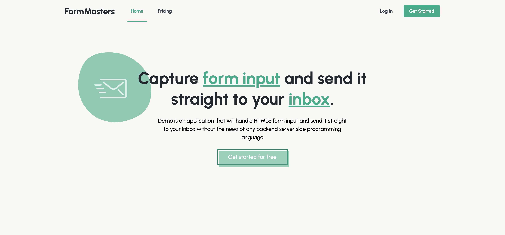
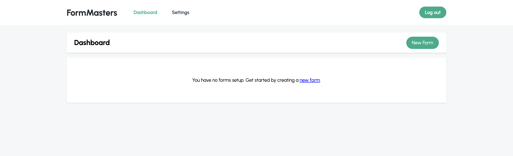
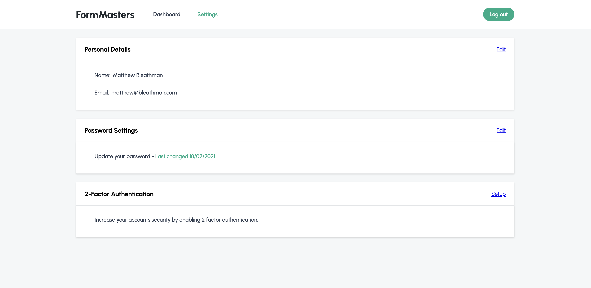

# FormMasters
FormMasters is a SaaS project by [@MatthewBleUK](https://github.com/MatthewBleUK) and [@AlyaKoluncheva](https://github.com/AlyaKoluncheva) for creating and capturing form content from websites without a backend (e.g static sites - github pages). 

Frontend: Thymeleaf, JavaScript, SCSS, HTML
Backend: Java, Spring Boot, MariaDB, Hibernate, google recaptcha API

The project is currently in development. 

## Features
- [x] Homepage
- [] MariaDB - 80% finished
- [x] Login 
- [x] Registration
- [x] Profile dashboard 
- [x] Profile settings 
- [] Backend Api - 0%

## ScreenShots

